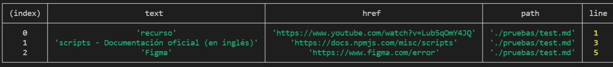
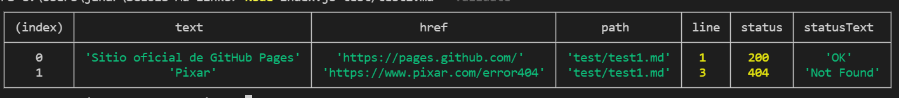
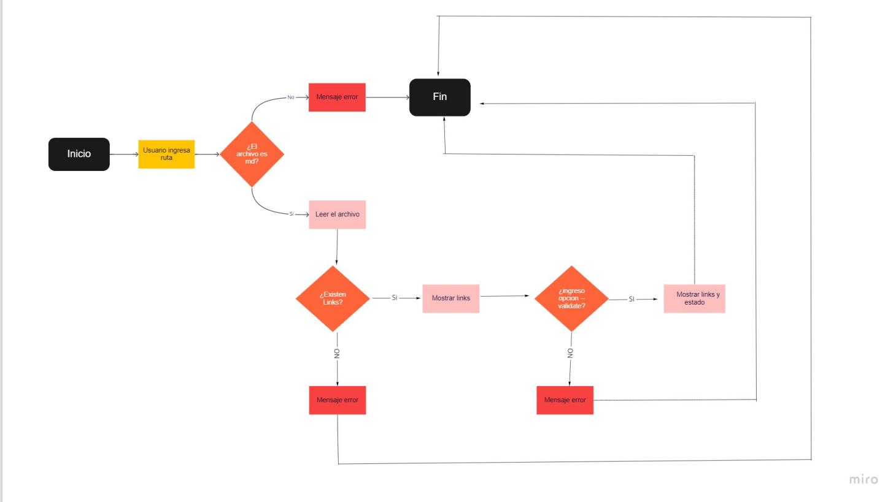

# [amr-md-links](https://www.npmjs.com/package/amr-md-links)

#### Es una librería que lee y analiza en formato Markdown, permite validar URL o links entregándonos información y sus estados, ejemplo(404, Not Found).

## Instalación

```sh
amr-md-links archivo.md
```

## ¿Cómo usar?

### En la terminal

Instalada la librería deberas escribir en la terminal, el comando junto al archivo.

`amr-md-links <archivo.md> [option]`

## CLI (Command Line Interface)

### Ejecución a través de la terminal:

`md-links <archivo.md> [option]`



Se obtiene como resultado:

- text: descripción del link.
- href: link encontrado
- path: archivo o ruta donde fue encontrado el link.
- line: linea donde fue encontrado el link.

## Options

### --validate

Entrega la validacion o status de los links (status: 200, ok, 404,fail, etc). Por ejemplo:

`md-links <archivo.md> --validate`



## Documentación técnica

### Dependencias:

- node.js versión v14.18.0
- node-fetch: "^3.1.0"
- jest: "^27.4.5"

## Planificación:

- Diagrama de Flujo en Miro.



- GitHub Proyects utilizando issues y milestones

[md-links Proyect](https://github.com/alemaureira22/SCL018-md-links/projects/1)

## Autor

### Alejandra Maureira
